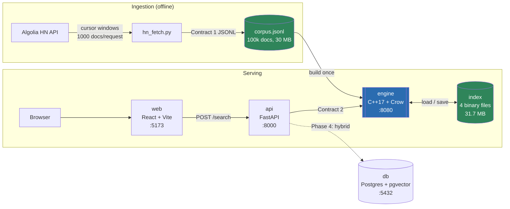

# Search Engine

A search engine built from scratch in C++17 — inverted index, BM25 ranking and
top-k retrieval written by hand, no Lucene, no IR library. It indexes 100,000
Hacker News stories and answers queries in **~1.7 ms cold, ~2 µs cached**, served
over HTTP through a FastAPI gateway to a React frontend.

```bash
make run      # db + engine + api + web, one command
```

---

## Example query

Search for `rust compiler` and the engine returns ranked results with snippets
drawn from around the matched terms:

```json
POST /search  {"query": "rust compiler", "k": 2}

{"results": [
  {"doc_id": 48926457, "score": 5.58,
   "snippet": "...not really a good way to keep Rust incremental build state around on ephemeral runners, so h..."},
  {"doc_id": 48924737, "score": 3.23,
   "snippet": "...thread-pool for C, C++, Rust, & Zig\nHi community! Wanted to share a project of mine that is ..."}],
 "latency_ms": 2}
```

---

## Architecture



**Query path.** The browser posts to the gateway, which validates input, applies
pagination and forwards Contract 2 verbatim to the engine. The engine parses the
query with the same tokenizer that built the index, intersects postings lists to
find candidates, ranks them with BM25, selects the top k with a bounded min-heap
and reads snippets from disk for the survivors only.

**Index lifecycle.** The corpus is parsed once. `save` writes four binary files;
every later boot `load`s them in 637 ms instead of rebuilding in 3,955 ms. The
container entrypoint decides which happens, so restarts are cheap.

---

## Benchmarks

100,000 Hacker News stories. Windows 11, MSVC 19.29 x64, Release.
Reproduce with `make bench`.

### Corpus and index

| Metric | Value |
|--------|-------|
| Documents | 100,000 |
| Corpus size | 30.4 MB |
| Distinct terms | 53,049 |
| **Index size on disk** | **31.7 MB** (1.04× the corpus) |
| — postings (`terms.bin`) | 4.4 MB |
| — document text (`docs.bin`) | 25.7 MB |
| — offset table (`docs.idx`) | 1.6 MB |
| **Index build time** | **3,955 ms** |
| **Load from disk** | **637 ms** (6.2× faster than rebuilding) |
| Resident memory for the doc store | 7.6 MB of offsets addressing 25.7 MB of text |

### Query latency

Microseconds, 16 queries × 25 repeats, k=10. Contract 2's `latency_ms` is an
integer and too coarse to take percentiles of, so `engine/tools/bench_query.cpp`
measures in-process.

| | p50 | p95 | p99 |
|---|-----|-----|-----|
| Cache disabled | 1,680 µs | 4,198 µs | 5,300 µs |
| **Cache warm** | **2.2 µs** | **3.1 µs** | 5.0 µs |
| Speedup on repeats | **764×** | **1354×** | |

Over HTTP the Contract 2 `latency_ms` field reports p50 0 ms, p95 7 ms, max 32 ms.

### What scaling revealed

Two results that only became visible at 100k — at 968 documents the whole index
fit in cache and neither could be observed:

**103× the documents cost 1.7× the p50 latency** (994 µs → 1,680 µs). That is the
entire argument for an inverted index: query time tracks the length of the
postings lists for the query's terms, not the size of the corpus.

**The vocabulary grew sublinearly** — 3,825 → 53,049 terms for 103× the documents,
a 13.9× increase. That is Heaps' law appearing in real data, and it is why the
postings occupy only 4.4 MB of a 31.7 MB index.

### Search quality

| Metric | Keyword (BM25) | Hybrid |
|--------|---------------|--------|
| precision@10 | _pending_ | _pending_ |
| nDCG@10 | _pending_ | _pending_ |

Not yet measured. Requires the labeled query set and evaluation harness — see
[`eval/README.md`](eval/README.md), which documents the pooling method and why
labeling against a subset would produce misleading numbers.

---

## Quick Start

Docker is the only prerequisite — no host Python, Node or C++ toolchain.

```bash
make run
```

That fetches the corpus, builds four images, builds the index and blocks until
every service is healthy. Then open **http://localhost:5173**.

**First run takes ~20 minutes**, and it is worth knowing where that goes:

| Step | Time | Why |
|------|------|-----|
| Corpus fetch | ~9 min | 100 API requests, rate-limited to be polite |
| Engine image | ~12 min | Compiles C++17 from source, fetches Crow, runs 9 test suites |
| Everything else | <1 min | |

Subsequent runs take seconds — the index loads from its volume and Docker layers
are cached.

**To see it working sooner**, fetch a smaller corpus first:

```bash
make corpus CORPUS_TARGET=5000    # ~30 seconds
make run
```

The published benchmarks all use the full 100,000-document corpus, so re-run
`make corpus` before quoting numbers.

```bash
make smoke    # POST a real query through the gateway
make stats    # index and cache counters
make bench    # the latency table above
make help     # everything else
```

| Service | URL | What it is |
|---------|-----|------------|
| web | http://localhost:5173 | React + Vite frontend |
| api | http://localhost:8000/docs | FastAPI gateway, OpenAPI UI |
| engine | http://localhost:8080/health | C++ engine, Contract 2 |
| engine stats | http://localhost:8080/stats | Index and query-cache counters |
| db | `localhost:5432` | PostgreSQL + pgvector |

### Without `make`

Every target is a single command; `mingw32-make` also works on Windows.

| Target | Command |
|--------|---------|
| `make run` | `docker compose -f infra/docker-compose.yml up -d --build --wait` |
| `make build` | `docker compose -f infra/docker-compose.yml build` |
| `make corpus` | `docker compose -f infra/docker-compose.yml run --rm ingest` |
| `make index` | `docker compose -f infra/docker-compose.yml run --rm -e BUILD_ONLY=1 engine` |
| `make down` | `docker compose -f infra/docker-compose.yml down` |
| `make clean` | `docker compose -f infra/docker-compose.yml down -v` |
| `make logs` | `docker compose -f infra/docker-compose.yml logs -f` |
| `make stats` | `curl -s http://localhost:8080/stats` |

---

## How it works

### 1. Ingestion — getting past a 1000-result cap

`hn_fetch.py` pulls Contract 1 JSONL from the Algolia HN API. The obvious
approach — page through results — tops out at 968 documents, because Algolia caps
*any single query* at 1000 results: ask for `hitsPerPage=1000` and the response
comes back with `nbPages=1`, and page 1 is empty.

The way past it is to change the query rather than the page. Each request filters
`created_at_i < the oldest timestamp seen so far` and asks for page 0 again,
opening a fresh 1000-result window further back in history. `--before` pins the
starting timestamp so the same command returns the same corpus — verified
byte-identical across independent runs, which is what makes the benchmarks
reproducible without committing 30 MB to git.

### 2. Text pipeline — one tokenizer, both paths

`search::tokenize` is used by the index build **and** the query path, so a term
in the index and a term from a query are produced identically by construction.

| Stage | What happens |
|-------|--------------|
| Fold | UTF-8 decode, lowercase, fold Latin diacritics to ASCII (`Café` → `cafe`), drop combining marks |
| Split | Break on anything not alphanumeric |
| Stop | Remove English stopwords, matched on the folded but **unstemmed** word |
| Stem | Porter stemming |

Stopwords are removed before stemming on purpose: stem first and `this` becomes
`thi`, which is no longer in the stopword list and leaks into the index.

The Porter implementation is written by hand from the 1980 paper and Porter's
reference C implementation, and **verified to agree with that reference on all
251,970 words** of the NLTK `words` + `brown` vocabularies.

### 3. Inverted index

```
term  →  [{doc_id, term_freq}, ...]   ascending by doc_id, one entry per document
```

Because a term appears exactly once per document in its list, the **length of the
list is the document frequency** — no separate counter to keep in sync. Document
lengths and the collection total are tracked during the build so `avg_doc_length`
cannot go stale.

### 4. Query execution

```
parse → candidates → BM25 → top-k → snippets
```

**Candidates.** AND intersects the postings lists of the distinct query terms,
smallest list first, so the work is bounded by the rarest term rather than the
corpus. OR unions them instead. The mode decides *which* documents get scored,
never their order.

**Ranking.** BM25 with k1=1.2, b=0.75:

```
idf = ln(1 + (N - df + 0.5) / (df + 0.5))
score = Σ idf · (tf · (k1 + 1)) / (tf + k1 · (1 - b + b · dl/avgdl))
```

Document frequency always comes from the whole collection, computed before any
candidate restriction — narrowing the candidate set must not change what a term
is worth.

**Top-k.** A bounded min-heap of size k, O(n log k), rather than sorting all n
candidates. Ties break on `doc_id` ascending so a given index and query always
produce byte-identical output.

**Snippets.** Built last, for the k survivors only — each is a disk read. Rather
than the head of the document, which rarely says anything about the query, the
snippet is the window covering the most *distinct* query terms:

```
query: "database index"
  ...the database can choose a sequential scan where an index scan would be far faster...
```

Cuts land on UTF-8 character boundaries. That is not cosmetic: 14.7% of documents
contain non-ASCII text, and half a character makes the JSON response invalid
UTF-8, which `nlohmann::json::dump()` throws on — turning a long document into a
500.

### 5. On-disk index format

Four files. Every integer little-endian, written byte by byte, so an index
written on one machine loads on another.

| File | Contents |
|------|----------|
| `meta.bin` | Magic `SEIX`, format version, counts (24 bytes) |
| `docs.idx` | `doc_id` → byte offset table, 16 bytes/document |
| `docs.bin` | Document title, url and text payloads |
| `terms.bin` | Term dictionary and postings |

Postings ascend by `doc_id`, so only the first is stored in full and the rest as
**varint gaps** — small numbers cost one byte instead of four.

Terms are written in sorted rather than hash order, which makes `save` output
byte-deterministic and lets `save → load → save` be verified by comparison.
`load` validates into local structures and only commits once everything checks
out, so a corrupt file leaves a working index untouched rather than half-replaced.

### 6. Doc store — offsets, not text

Only the offset table lives in memory: **7.6 MB addressing 25.7 MB of text**, or
about 76 bytes per document. Title, url and text are read from disk on demand, so
memory grows with the document *count*, not with corpus size.

Every read opens its own stream rather than sharing one. That keeps the store
safe to call from Crow's worker threads with no lock — deliberate, because a
shared stream behind a mutex would serialise snippet extraction across every
in-flight query.

### 7. Query result cache

An LRU cache keyed by the **parsed terms**, not the raw string, so
`"rust compiler"`, `"RUST COMPILERS!"` and `"the rust compiler"` share one entry.
Terms are sorted, so word order does not split the key either — safe because BM25
sums independent per-term contributions and the tie-break is on `doc_id`.

A `std::list` in recency order plus a map from key to list position makes lookup,
promotion and eviction all O(1), under one mutex. It is invalidated on every index
change: a cache that outlives its index serves results for documents that are no
longer there, and that failure is silent.

---

## Contracts

Two frozen interfaces the whole system is built around.

### Contract 1 — Document JSONL (one JSON object per line)

```json
{"doc_id": <int>, "title": <str>, "url": <str>, "text": <str>}
```

### Contract 2 — Engine Query API

```
POST /search
  request:  {"query": <str>, "k": <int>}
  response: {"results": [{"doc_id": <int>, "score": <float>, "snippet": <str>}], "latency_ms": <int>}
```

Results are sorted by `score` **DESC**; score is raw BM25.

Conformance is verified at scale rather than assumed: 168 requests across 42
query shapes — non-ASCII, CJK, emoji, punctuation-only, stopword-only, empty —
at k ∈ {1, 3, 10, 50}, asserting exact response keys, `doc_id` int, finite
`score`, valid-UTF-8 `snippet`, `latency_ms` int ≥ 0, `len(results) ≤ k` and
strict ordering. 1,865 results, **zero violations**.

---

## Stack

| Layer       | Technology                        | Directory |
|-------------|-----------------------------------|-----------|
| Core Engine | C++17, Crow (header-only HTTP)    | `/engine` |
| Ingestion   | Python                            | `/ingest` |
| API Gateway | Python, FastAPI                   | `/api`    |
| Frontend    | React, Vite                       | `/web`    |
| ML          | Python (embeddings, fusion, eval) | `/ml`     |
| Infra       | Docker Compose                    | `/infra`  |
| Evaluation  | Labeled query set + results       | `/eval`   |
| Database    | PostgreSQL + pgvector             | —         |

---

## Testing

```bash
make test          # every suite
make test-engine   # 9 C++ suites, run inside the image build
make test-api      # FastAPI gateway
make test-ingest   # ingestion, all HTTP mocked
make test-web      # frontend lint
```

The engine image runs `ctest` as a **build step**, so a failing C++ test fails the
image build and `make run` cannot start a broken engine.

| Suite | Covers |
|-------|--------|
| `tokenizer_tests` | Folding, splitting, stopwords, every Porter step, UTF-8 edge cases |
| `index_tests` | Postings, term frequencies, doc lengths, collection stats |
| `bm25_tests` | Scores against hand calculations |
| `topk_tests` | Heap selection and ordering |
| `persist_tests` | Round trip, byte-determinism, every corruption rejection path |
| `docstore_tests` | Disk-backed reads, bounded memory, snippet boundaries |
| `query_tests` | Parsing, AND/OR candidates, focused snippets |
| `cache_tests` | LRU eviction, concurrency, invalidation |
| `engine_tests` | End-to-end search behaviour |

---

## Configuration

Everything has a default; `.env` is optional. Copy `.env.example` to `.env` only
to override.

| Variable | Default | Purpose |
|----------|---------|---------|
| `WEB_PORT` / `API_PORT` / `ENGINE_PORT` / `POSTGRES_PORT` | 5173 / 8000 / 8080 / 5432 | Host ports |
| `POSTGRES_USER` / `POSTGRES_PASSWORD` / `POSTGRES_DB` | search / search / searchdb | Database |
| `JSONL_PATH` | `/data/corpus.jsonl` | Corpus inside the engine container |
| `INDEX_PATH` | `/index` | Index location on the engine volume |
| `BUILD_ONLY` | unset | Build the index and exit instead of serving |
| `QUERY_CACHE_CAPACITY` | 256 | Query-cache entry limit; `0` disables it |
| `CORPUS_TARGET` | 100000 | Documents `make corpus` fetches |

---

## Troubleshooting

**Port already in use** — set the port in `.env` and `make run` again.

**`corpus ... does not exist`** — `make corpus`, then `make run`.

**Engine unhealthy or the API returns 502** — `make logs`. The API's `/health`
reports engine reachability separately, so `curl localhost:8000/health` tells you
which side is at fault.

**Stale results after re-fetching the corpus** — `make reindex`. The engine keeps
loading the saved index until you replace it.

**Start over completely** — `make clean` removes the index and database volumes.

See individual directory READMEs for component-specific detail:
[`engine`](engine/README.md) · [`ingest`](ingest/README.md) ·
[`api`](api/README.md) · [`web`](web/README.md) · [`infra`](infra/README.md) ·
[`eval`](eval/README.md)
